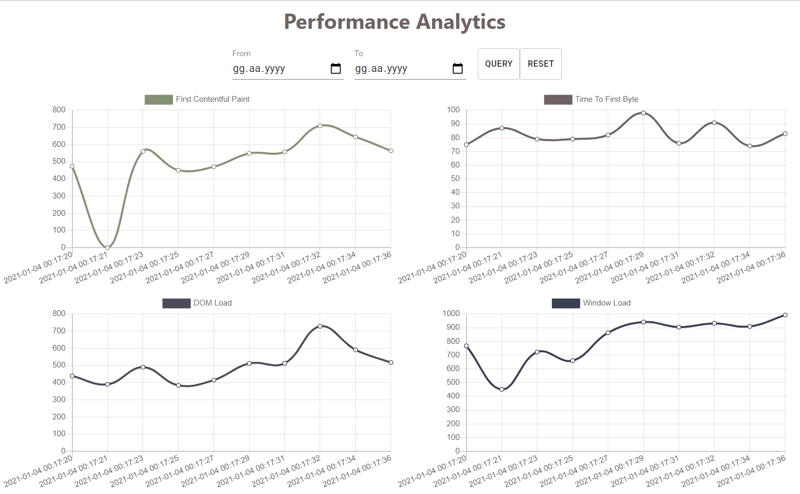

# Performance Analytics Dashboard

[DEMO](https://perf-analytics-dashboard.herokuapp.com/) - First opening can take a while because of heroku's free dyno.

This application shows the performance metrics of itself from last 30 minutes. Specific time interval can be selected.



## Install

```
$ npm install
```

## Environment variables

Create `.env` file.

```
REACT_APP_API_URL=https://performance-analytics-api.herokuapp.com
```

## Commands

- `npm start` - Start applicaiton in development mode
- `npm run build` - Build application for production.
